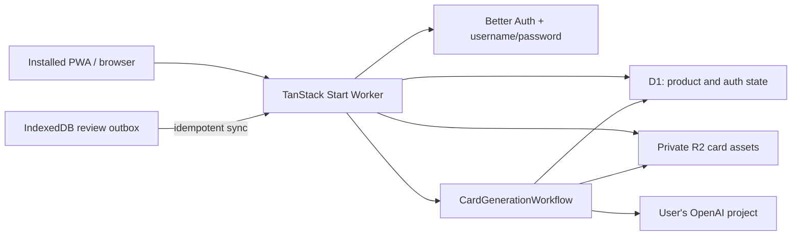
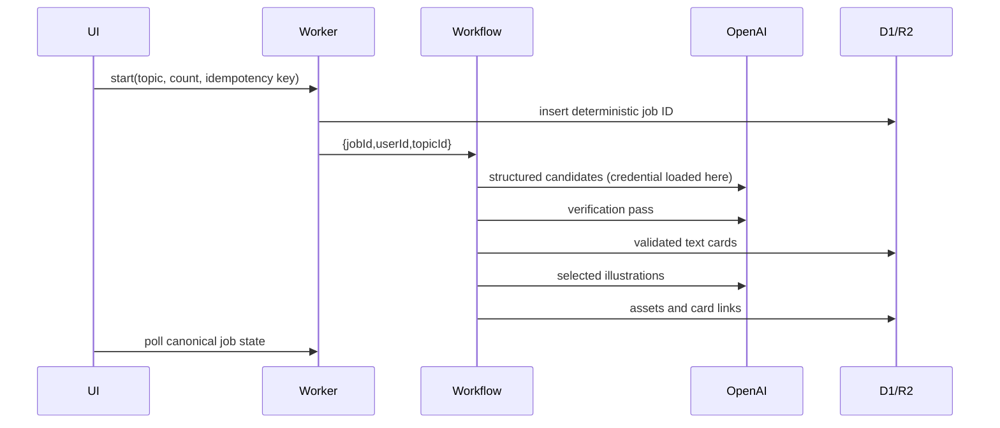

# Architecture

## System map

The Worker is the only trust boundary exposed to the browser. The running Worker uses Cloudflare bindings, never a Cloudflare management token. OpenAI credentials are decrypted only in memory immediately before a provider call and never enter Workflow parameters or browser state.

## Source boundaries

- `src/shared/contracts`: dependency-neutral Zod schemas and serialized public types.
- `src/server/domain`: pure fingerprinting, validation, and FSRS replay.
- `src/server/db`: Drizzle schema and D1 client construction.
- `src/server/auth`, `crypto`, `security`, `observability`: cross-feature server capabilities.
- `src/server/topics`, `study`, `progress`, `generation`, `ai`: feature-owned server logic.
- `src/server/functions`: thin authenticated TanStack server-function adapters.
- `src/routes/api`: the three stable raw HTTP surfaces needed by auth, the service worker, and private assets.
- `src/features`: route-facing React components. Routes remain thin.
- `src/pwa`: service worker, queue cache, and review outbox.

## Core data flows

### Review and scheduling

1. The client creates a sortable unique review ID and stores the event in IndexedDB before changing cards.
2. `POST /api/reviews/sync` accepts at most 100 events and scopes every card to the authenticated owner.
3. D1 inserts new events by primary key; acknowledged duplicates are returned without reapplying a rollup.
4. Every affected card is replayed from its complete immutable history ordered by `(reviewed_at, id)` with FSRS fuzz disabled.
5. `card_schedules` is replaced with the authoritative projection, and `daily_progress` is incremented only for newly accepted events.

This retains concurrent reviews from multiple offline devices. The event log is truth; the schedule and daily table are rebuildable projections.

### Generation

`provider_calls` is a spend-safety ledger. A step must move `prepared → started` before a provider request. A Workflow retry that finds `started` without a persisted step result changes the record to `ambiguous` and stops; it does not issue another billable request. An explicit new user action creates a new job and therefore a new ledger scope.

Exact guitar diagrams are rendered from an allowlisted semantic schema. No model-authored SVG or HTML is rendered. Illustrations are PNG, capped at 15 MiB, signature/dimension checked, and stored in R2 after the billable Workflow step result has been persisted.

## Data invariants

- Every owner-scoped entity carries `user_id`; IDs alone never authorize access.
- Account creation requires an invited email plus a one-time random code whose SHA-256 digest—not plaintext—is stored in D1.
- Usernames are unique after lowercase normalization; passwords are hashed by Better Auth and never enter application logs.
- Review events are append-only and globally unique by client event ID.
- One `(user_id, card_id)` schedule is a projection, not history.
- Card fingerprints are unique within a topic.
- One queued/running generation is allowed per topic by a partial unique index.
- Active generation slots are unique per user while queued/running, making the two-job user cap authoritative even under concurrent starts.
- A deterministic job ID makes a repeated idempotency key return the existing job.
- One credential exists per user and its AAD binds credential ID, owner ID, provider, and key version.
- Archiving cards/topics preserves review history; deletion is an explicit cascading action.
- R2 keys are private and only resolved after session and owner checks.

## Deliberate v1 exclusions

There is no Agents SDK, Durable Object, WebSocket state, web-research agent, or offline generation. Workflows provide the durable background boundary this product needs without adding an actor model. Background Sync is only an enhancement; the browser also synchronizes on application start, reconnect, focus, visibility, and each online rating batch.
