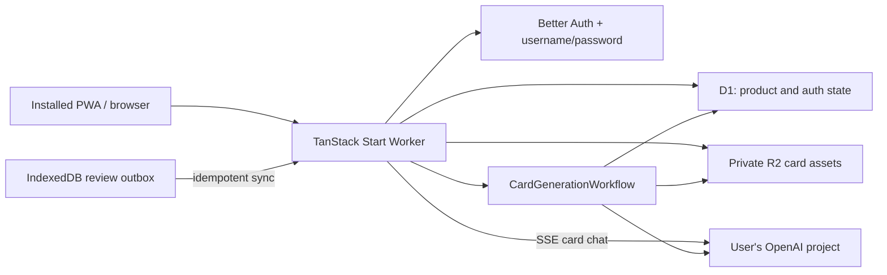
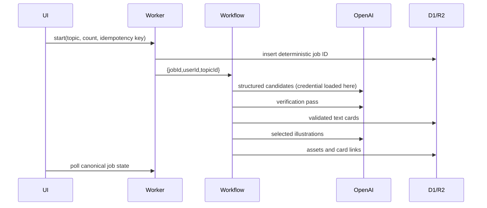

# Architecture

## System map

The Worker is the only trust boundary exposed to the browser. The running Worker uses Cloudflare bindings, never a Cloudflare management token. OpenAI credentials are decrypted only in memory immediately before a provider call and never enter Workflow parameters or browser state.

## Source boundaries

- `src/shared/contracts`: dependency-neutral Zod schemas and serialized public types.
- `src/server/domain`: pure fingerprinting, validation, and FSRS replay.
- `src/server/db`: Drizzle schema and D1 client construction.
- `src/server/auth`, `crypto`, `security`, `observability`: cross-feature server capabilities.
- `src/server/topics`, `study`, `progress`, `generation`, `chat`, `ai`: feature-owned server logic.
- `src/server/functions`: thin authenticated TanStack server-function adapters.
- `src/routes/api`: stable raw HTTP surfaces for auth, review synchronization, private assets, and card-chat streams.
- `src/features`: route-facing React components. Routes remain thin.
- `src/pwa`: service worker, queue cache, and review outbox.

### First-login onboarding

The authenticated root loader checks only the persisted onboarding completion marker before it renders the application shell. An incomplete account is gated into a resumable four-step workflow:

1. Add at least one active topic through the normal owner-scoped topic service.
2. Confirm timezone, daily review goal, and text/visual balance in `user_preferences`.
3. Validate and encrypt a user-owned OpenAI project key through the credential service.
4. Complete setup only after the onboarding service re-reads those three server-owned facts.

`user_preferences.onboarding_step` is a resumable presentation checkpoint; it does not grant access by itself. `onboarding_completed_at` is written only after the readiness invariants pass. Existing accounts are backfilled as complete by the additive migration, while accounts created after the migration begin at step zero.

## Core data flows

### Review and scheduling

1. The client creates a sortable unique review ID and stores the event in IndexedDB before changing cards.
2. `POST /api/reviews/sync` accepts at most 100 events and scopes every card to the authenticated owner.
3. D1 inserts new events by primary key; acknowledged duplicates are returned without reapplying a rollup.
4. Every affected card is replayed from its complete immutable history ordered by `(reviewed_at, id)` with FSRS fuzz disabled.
5. `card_schedules` is replaced with the authoritative projection, and `daily_progress` is incremented only for newly accepted events.

This retains concurrent reviews from multiple offline devices. The event log is truth; the schedule and daily table are rebuildable projections.

### Generation

`provider_calls` is a spend-safety ledger. A step must move `prepared → started` before a provider request. A Workflow retry that finds `started` without a persisted step result changes the record to `ambiguous` and stops; it does not issue another billable request. An explicit new user action creates a new job and therefore a new ledger scope.

Exact guitar diagrams are rendered from an allowlisted semantic schema. No model-authored SVG or HTML is rendered. Illustrations are PNG, capped at 15 MiB, signature/dimension checked, and stored in R2 after the billable Workflow step result has been persisted.

### Card-aware chat

1. Chat is available only after a study card is revealed. Opening the panel performs an owner-scoped lookup for the latest thread with the same card version but writes nothing.
2. The first send atomically inserts an immutable `card_chat_threads` snapshot, the client-ID user message, and a streaming assistant placeholder before contacting OpenAI.
3. The browser sends only the latest question. The Worker reloads the complete saved transcript and validated snapshot, adds the private R2 image at low detail when applicable, and streams a plain-text response over HTTP SSE.
4. A partial unique index permits one streaming response per user. Locks older than 90 seconds are marked aborted before a new claim.
5. `consumeStream` plus the Worker lifetime extension drains a response after disconnect, while request cancellation records stopped/aborted partial text. Completion persists provider response ID and aggregate usage.
6. Duplicate user-message IDs return the existing completed answer and never create another provider call. Failed or aborted attempts require an explicit retry and create a separate assistant attempt.

Card/topic text is delimited as untrusted study material. Chat has no tools, web search, attachments, provider-managed conversation state, or access to other cards and review history. Saved `/chats` routes are online-only and `no-store`; transcripts never enter Cache Storage or IndexedDB.

## Data invariants

- Every owner-scoped entity carries `user_id`; IDs alone never authorize access.
- Account creation requires an invited email plus a one-time random code whose SHA-256 digest—not plaintext—is stored in D1.
- Usernames are unique after lowercase normalization; passwords are hashed by Better Auth and never enter application logs.
- Review events are append-only and globally unique by client event ID.
- One `(user_id, card_id)` schedule is a projection, not history.
- Card fingerprints are unique within a topic.
- One queued/running generation is allowed per topic by a partial unique index.
- Active generation slots are unique per user while queued/running, making the two-job user cap authoritative even under concurrent starts.
- A deterministic job ID makes a repeated idempotency key return the existing job.
- One credential exists per user and its AAD binds credential ID, owner ID, provider, and key version.
- A chat thread owns one immutable, schema-validated card snapshot; later card edits never rewrite it.
- One streaming chat assistant row per user is enforced in D1, and one completed reply is reused for a duplicate user-message ID.
- Archiving a card retains its chats. Explicit chat deletion removes its messages; card, topic, and account deletion cascade chat threads.
- The authenticated application shell remains gated until the user has an active topic, saved preferences, and a credential that can read the configured OpenAI model.
- Archiving cards/topics preserves review and chat history; deletion is an explicit cascading action.
- R2 keys are private and only resolved after session and owner checks.

## Deliberate v1 exclusions

There is no Agents SDK, Durable Object, WebSocket state, web-research agent, offline generation, offline transcript storage, resumable chat stream, citation layer, message editing, attachment, voice input, or automated thread naming. Workflows provide the durable background generation boundary this product needs without adding an actor model. Card chat uses a short-lived HTTP stream with D1 persistence. Background Sync is only an enhancement for reviews; the browser also synchronizes on application start, reconnect, focus, visibility, and each online rating batch.
